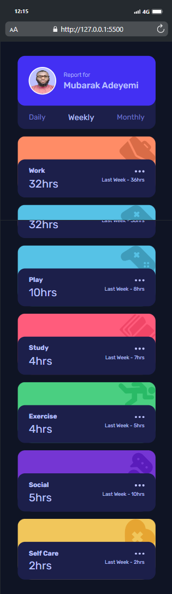
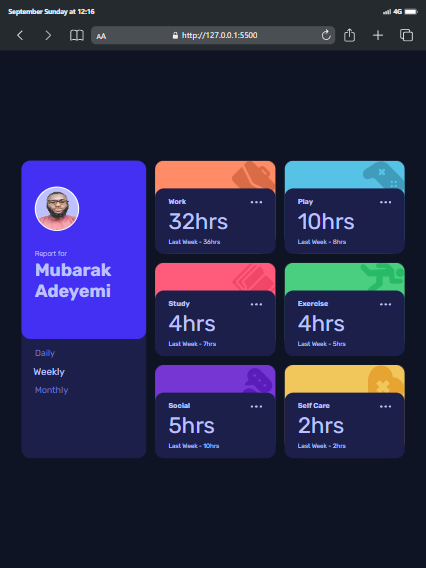
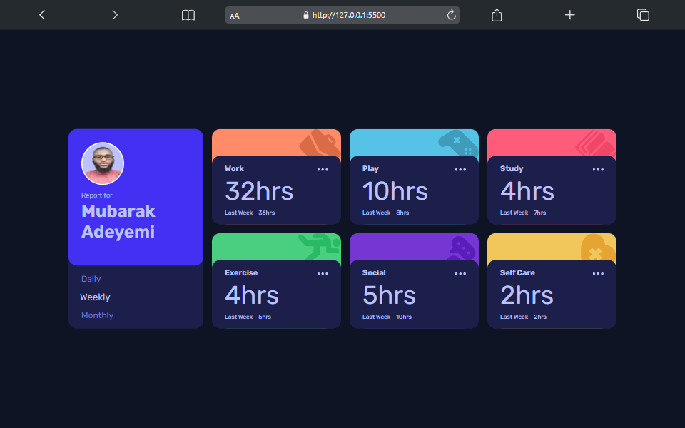

# Frontend Mentor - Time tracking dashboard solution

This is a solution to the
[Time tracking dashboard challenge on Frontend Mentor](https://www.frontendmentor.io/challenges/time-tracking-dashboard-UIQ7167Jw).
Frontend Mentor challenges help you improve your coding skills by building
realistic projects.

## Table of contents

- [Overview](#overview)
  - [The challenge](#the-challenge)
  - [Screenshot](#screenshot)
  - [Links](#links)
- [My process](#my-process)
  - [Built with](#built-with)
  - [What I learned](#what-i-learned)
  - [Continued development](#continued-development)
  - [Useful resources](#useful-resources)
- [Author](#author)
- [Acknowledgments](#acknowledgments)

## Overview

### The challenge

Users should be able to:

- View the optimal layout for the site depending on their device's screen size
- See hover states for all interactive elements on the page
- Switch between viewing Daily, Weekly, and Monthly stats

### Screenshot





### Links

- Solution URL:
  [Tme tracking dashboard](https://github.com/Mubarak-Adeyemi/time-tracking-dashboard-main)
- Live Site URL:
  [Tme tracking dashboard](https://mubarak-adeyemi.github.io/time-tracking-dashboard-main/)

## My process

### Built with

- Semantic HTML5 markup
- CSS custom properties
- Flexbox
- CSS Grid
- Mobile-first workflow
- Vanilla JavaScript for dynamic functionality

### What I learned

Throughout this project, I improved my skills in:

- **CSS Grid**: Using CSS Grid to create responsive layouts that adapt to
  different screen sizes.
- **JavaScript Fetch API**: Implementing the Fetch API to load data dynamically
  and render it into the DOM.
- **Accessibility**: Enhancing the accessibility of the dashboard using
  appropriate ARIA attributes.

Example of using CSS Grid:

```css
.cards {
  display: grid;
  grid-template-columns: repeat(2, 1fr);
  gap: 1rem;
}
```

Example of a JavaScript function for rendering cards:

```js
function renderCards(timeframe, data) {
  const cardsContainer = document.querySelector(".cards");
  cardsContainer.innerHTML = "";

  data.forEach((item) => {
    const current = item.timeframes[timeframe].current;
    const previous = item.timeframes[timeframe].previous;
    // ...additional code
  });
}
```

### Continued development

I plan to continue improving my understanding of:

- Advanced JavaScript features like Promises and Async/Await for more complex
  data handling.
- Responsive design techniques to enhance user experience on various devices.
- Accessibility best practices to ensure all users can effectively use my
  applications.

### Useful resources

- [CSS Tricks: Complete Guide to Grid](https://css-tricks.com/snippets/css/complete-guide-grid/) -
  This article was invaluable for understanding CSS Grid layouts.
- [MDN Web Docs](https://developer.mozilla.org/en-US/) - A comprehensive
  resource for all web development topics, particularly helpful for JavaScript
  and HTML.

## Author

- Frontend Mentor -
  [@Mubarak-Adeyemi](https://www.frontendmentor.io/profile/Mubarak-Adeyemi)
- Twitter - [@mubarakElarabiy](https://www.twitter.com/muabarakElarabiy)

## Acknowledgments

Thanks to the Frontend Mentor community for inspiration and support.
